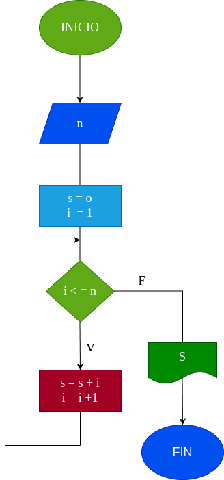

# While_1

# Analisis

## Input

### Variables de entrada

n: Numero al que se desea aplicar la formula

### Proccesing

s: Valor inicial de la suma

i: Valor correspondiente al siguente dijito a sumar

Mientras i <= n:

s = s + 1

i = i + 1

### Output
s

# Diseño

# Construcción